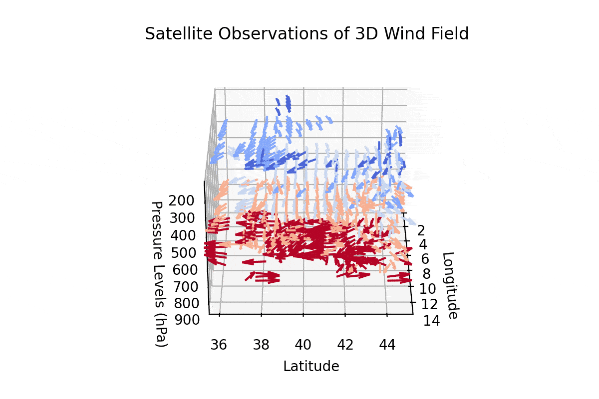

## Hi there 👋

I am a physicist tha uses geospatial data science for atmospheric and remote-sensing research at the University of Arizona. Some highlights:

Code: [3d-amvs](https://github.com/aouyed/3d-amvs/)
A pioneering algorithm to observe global 3D winds (for the first time!) from infrared satellites through a computer vision algorithm that uses concepts from AI (e.g. loss function regularization). You can see me in the [local TV news](https://www.kold.com/2023/04/14/scientists-university-arizona-develop-new-way-measure-wind-improving-future-weather-forecasting/) where I talk about this project, which was also mentioned in the [world economic forum](https://www.weforum.org/stories/2023/04/this-algorithm-could-help-better-predict-extreme-weather-events/). 

Code: [s2s-forecast-ml](https://github.com/aouyed/s2s-forecast-ML)
An environmental forecasting model that predicts temperature and precipitation one month ahead using convolutional neural networks. This is an effort for a funded NASA grant that I co-wrote. (https://github.com/aouyed/s2s-forecast-ML). 

Code: [met-cv](https://github.com/aouyed/metcv)
A two-stage artificial intelligence algorithm that corrects noisy satellite wind observation by learning the correction from physics based weather simulations. 

